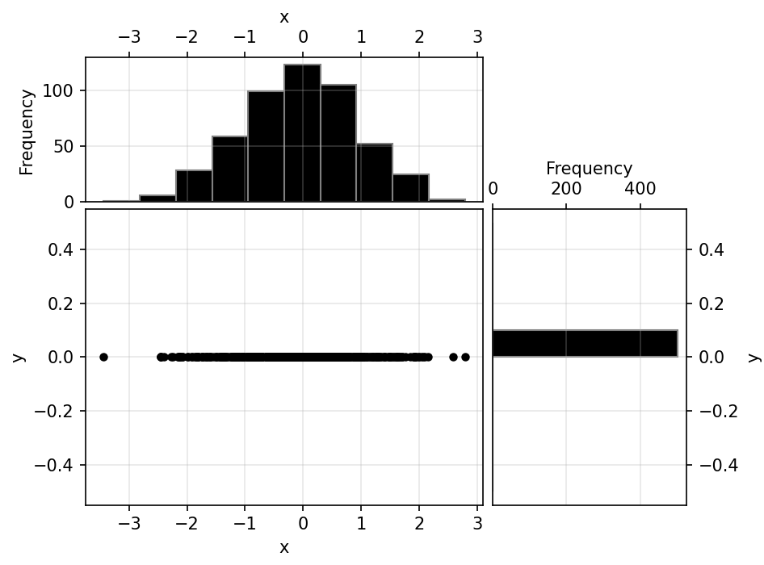
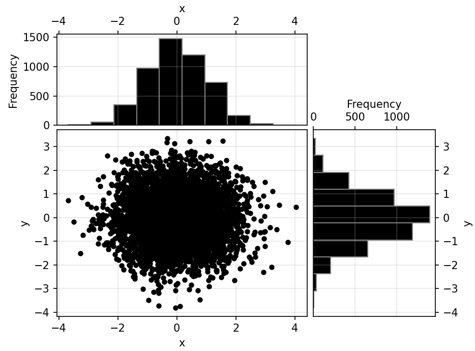

# ScatHistPlot

## Table of contents
1. [Introduction](#introduction)
2. [How to](#howto)
3. [Dependencies](#dependencies)

## Introduction <a id="introduction"></a>

A combined scatter-histogram plot for displaying (large) volumes of potentially
overlapping/closely spaced 2D data.
Looking only at a regular scatter plot in such case might hide potential density 
variations. Hence, combining the scatter with two histograms.

Extreme example:



## How to <a id="howto"></a>
Import the package into an existing .py file or call the function inside scathistplot.py.
Below is a code snippet for generating output using example data and default axes labeling.
```
x = np.random.normal(0, 1, 5000)
y = np.random.normal(0, 1, 5000)
scathistplot(x, y, xlabel='x', ylabel='y', histlabel='Frequency')
```
The code produces the following plot:



## Dependencies <a id="dependencies"></a>

|  Package   | Mandatory |           Description            |
|:----------:|:---------:|:--------------------------------:|
| matplotlib |    yes    |                -                 |
|   NumPy    |    no     | for generating example data only |
